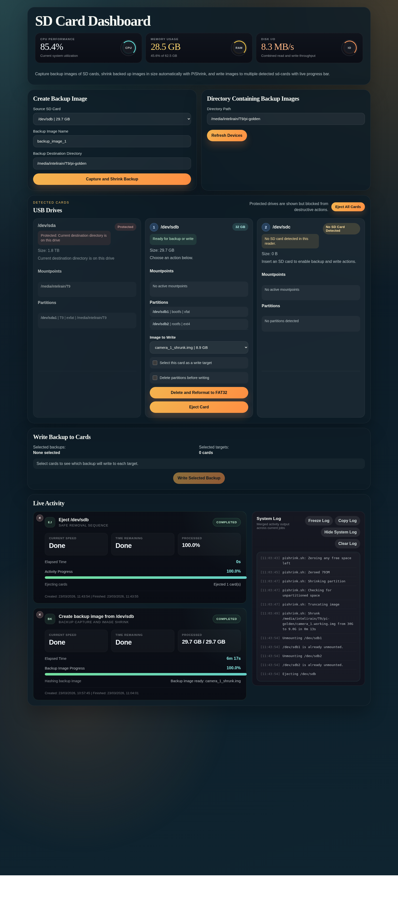

# SD Card Dashboard

`SD Card Dashboard` is a localhost-first web UI for backing up Raspberry Pi OS or any other SD cards, shrinking the captured image automatically with [PiShrink](https://github.com/Drewsif/PiShrink), and providing ability to flash one or more SD cards in parallel from a clean dashboard with live progress tracking.

It is designed for SDcard backup and flash imaging workflows where a workstation needs direct access to removable USB card reader drives, accurate device visibility, and a simple operator-friendly interface.

## Screenshot



## Overview

This dashboard runs in Docker, serves a browser UI on `http://localhost:8099`, and manages a host-side SD card workflow with a Python backend.

Core workflow:

1. Detect removable USB drives or SD card readers and show them in the dashboard.
2. Capture a backup image from a selected source SD card using `dd`.
3. Automatically run `pishrink.sh` on the captured image.
4. Save the resulting image in the configured backup directory.
5. Write selected images back to one or more detected target cards.
6. Show live progress, timing, and system log while operations run.

## Features

- Create backup images directly from SD cards.
- Automatically shrink captured images with PiShrink.
- Save images to a configurable backup directory.
- Default backup directory support through Docker environment variables.
- Detect removable USB drives or SDcard readers and show device paths such as `/dev/sdb`, `/dev/sdc`, and `/dev/sdd`.
- Show mount points and partition information for each detected card.
- Protect the active destination drive and system-mounted disks from destructive operations.
- Write the same image or different images to multiple selected target cards.
- Use `dd` as the write backend with live progress parsing.
- Show live activity cards with progress bars, elapsed time, per-target details, and a shared system log.
- Clear and reformat cards to FAT32 with sequential `SDcardN` labels.
- Eject individual cards or all removable cards from the dashboard.
- Run as a Dockerized localhost service with an optional `systemd` boot unit.

## Architecture

- Backend: Python HTTP server
- Frontend: HTML, CSS, and vanilla JavaScript
- Runtime: Docker Compose
- Imaging backend: `dd`
- Image shrinking: PiShrink (`pishrink.sh`)
- Device discovery: host block-device inspection via `/dev`, `/sys`, and `udev`

Key files:

- Backend: `app/server.py`
- Frontend HTML: `app/static/index.html`
- Frontend styles: `app/static/styles.css`
- Frontend logic: `app/static/app.js`
- Docker definition: `Dockerfile`
- Compose stack: `docker-compose.yml`
- Boot service: `sdcard-dashboard-compose.service`

## Safety Notes

This project performs real disk operations.

- Always double-check the selected target devices before writing.
- Never loosen the protected-drive logic unless you are certain what will become writable.
- Use the dashboard only when you are comfortable identifying removable media on your workstation.
- This container runs `privileged` because it must access host block devices and related system interfaces.

## Host Prerequisites

The containerized dashboard depends on a few host-side tools and paths:

- Docker Engine
- Docker Compose plugin
- `pishrink.sh` installed on the host at `/usr/local/bin/pishrink.sh`
- `udisks2` and D-Bus if you want eject actions to work reliably
- A real backup destination path, or an updated `DEFAULT_DESTINATION_DIR`

## Ubuntu Prerequisite Commands

These commands prepare a fresh Ubuntu system for this dashboard.

### 1. Install Docker Engine and Docker Compose

```bash
sudo apt update
sudo apt install -y ca-certificates curl
sudo install -m 0755 -d /etc/apt/keyrings
sudo curl -fsSL https://download.docker.com/linux/ubuntu/gpg -o /etc/apt/keyrings/docker.asc
sudo chmod a+r /etc/apt/keyrings/docker.asc

echo \
  "deb [arch=$(dpkg --print-architecture) signed-by=/etc/apt/keyrings/docker.asc] https://download.docker.com/linux/ubuntu \
  $(. /etc/os-release && echo "${UBUNTU_CODENAME:-$VERSION_CODENAME}") stable" | \
  sudo tee /etc/apt/sources.list.d/docker.list > /dev/null

sudo apt update
sudo apt install -y docker-ce docker-ce-cli containerd.io docker-buildx-plugin docker-compose-plugin
sudo systemctl enable --now docker
```

Optional:

```bash
sudo usermod -aG docker "$USER"
```

Log out and back in after adding yourself to the `docker` group.

### 2. Install host packages used by the SD card workflow

```bash
sudo apt update
sudo apt install -y \
  dbus \
  dosfstools \
  e2fsprogs \
  gzip \
  parted \
  pigz \
  udev \
  udisks2 \
  wget \
  xz-utils
```

### 3. Install PiShrink on the host

```bash
wget https://raw.githubusercontent.com/Drewsif/PiShrink/master/pishrink.sh
chmod +x pishrink.sh
sudo install -m 0755 pishrink.sh /usr/local/bin/pishrink.sh
rm -f pishrink.sh
```

### 4. Create your backup destination directory

Update this to match your real storage device if needed:

```bash
sudo mkdir -p /media/$USER/T9/pi-golden
```

## Setup Instructions for Linux OS

After installing all prerequisites, clone the repository, place it in the expected folder path, review the default backup destination, and then launch the dashboard.

### 1. Clone the repository

```bash
mkdir -p /home/username/Desktop
git clone https://github.com/saad-git-007/sd-card-dashboard.git /home/username/Desktop/SD_dashboard_folder
```

### 2. Enter the project directory

```bash
cd /home/username/Desktop/SD_dashboard_folder
```

### 3. Review the default backup destination

Open `docker-compose.yml` and update `DEFAULT_DESTINATION_DIR` if your backup drive or mount path is different from the example used in this repository.

### 4. Build and start the dashboard

```bash
sudo docker compose up --build -d
```

### 5. Confirm the container is running

```bash
sudo docker compose ps
curl http://localhost:8099/healthz
```

### 6. Open the dashboard

```text
http://localhost:8099
```

### 7. Optional: enable automatic startup on boot with systemd

```bash
sudo install -m 0644 sdcard-dashboard-compose.service /etc/systemd/system/sdcard-dashboard-compose.service
sudo systemctl daemon-reload
sudo systemctl enable --now sdcard-dashboard-compose.service
sudo systemctl status sdcard-dashboard-compose.service
```

## Configuration

The default runtime settings live in `docker-compose.yml`:

- Host port: `8099`
- App port inside container: `8080`
- Default backup directory: `/media/user-name/T9/pi-golden`
- PiShrink path in container: `/usr/local/bin/pishrink.sh`

If your backup drive or path is different, update:

- `DEFAULT_DESTINATION_DIR` in `docker-compose.yml`

## Common Docker Commands

Start:

```bash
sudo docker compose up -d
```

Rebuild and start:

```bash
sudo docker compose up --build -d
```

Show logs:

```bash
sudo docker compose logs -f
```

Stop and remove the stack:

```bash
sudo docker compose down
```

## Run Automatically on Boot with systemd

This repository includes a boot unit file: `sdcard-dashboard-compose.service`

Install and enable it:

```bash
cd /home/username/Desktop/SD_dashboard_folder
sudo install -m 0644 sdcard-dashboard-compose.service /etc/systemd/system/sdcard-dashboard-compose.service
sudo systemctl daemon-reload
sudo systemctl enable --now sdcard-dashboard-compose.service
```

Check status:

```bash
sudo systemctl status sdcard-dashboard-compose.service
```

Restart the boot-managed compose stack:

```bash
sudo systemctl restart sdcard-dashboard-compose.service
```

Disable automatic boot startup:

```bash
sudo systemctl disable --now sdcard-dashboard-compose.service
```

How it works:

- `ExecStart` runs `docker compose up -d --remove-orphans`
- `ExecReload` reruns the same command
- `ExecStop` runs `docker compose down`

This is more reliable than relying only on Docker container restart policy because it recreates the compose project and network if needed.

## Troubleshooting

### Docker is running, but the dashboard is missing after reboot

Try:

```bash
sudo systemctl restart docker.socket docker
sudo systemctl restart sdcard-dashboard-compose.service
```

Then check:

```bash
sudo systemctl status sdcard-dashboard-compose.service --no-pager
sudo docker compose ps
curl http://localhost:8099/healthz
```

### Docker is active, but /run/docker.sock still refuses connections after reboot

On some Ubuntu systems, Docker can appear active before its API socket becomes fully usable. If that happens, verify `containerd` is enabled and that Docker has an override forcing it to wait for `containerd.service` and `docker.socket`.

Check the current state:

```bash
sudo systemctl status docker containerd --no-pager
sudo systemctl is-enabled containerd.service
sudo systemctl cat docker.service
```

If needed, enable `containerd`:

```bash
sudo systemctl enable containerd.service
```

If needed, create or update the Docker override:

```bash
sudo mkdir -p /etc/systemd/system/docker.service.d
sudo nano /etc/systemd/system/docker.service.d/override.conf
```

Use:

```ini
[Unit]
After=containerd.service network-online.target docker.socket
Requires=containerd.service docker.socket
Wants=network-online.target
```

Then reload and restart Docker:

```bash
sudo systemctl daemon-reload
sudo systemctl restart docker
```

This repository's `sdcard-dashboard-compose.service` already includes an `ExecStartPre` wait loop that waits for `docker info` to succeed before starting the dashboard, which helps avoid dashboard startup races even when Docker is slower to become ready after boot.

### Port `8099` is already in use

Change the published port in `docker-compose.yml`, for example:

```yaml
ports:
  - "8100:8080"
```

Then rebuild:

```bash
sudo docker compose up --build -d
```

### PiShrink fails

Check that the host file exists:

```bash
ls -l /usr/local/bin/pishrink.sh
```

### Eject actions fail

Check that `udisks2` and D-Bus are available on the host:

```bash
sudo systemctl status udisks2 --no-pager
```

## Repository Setup Notes

This project is suitable for local development, imaging stations, and internal deployment on Ubuntu-based hosts that need direct access to removable SD cards.
